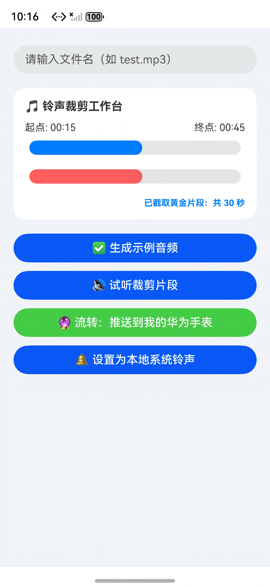
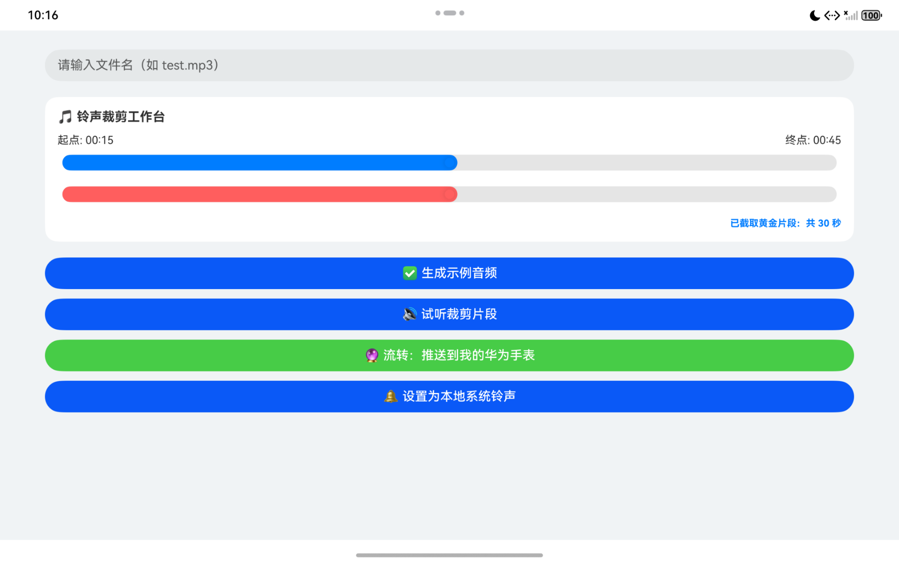
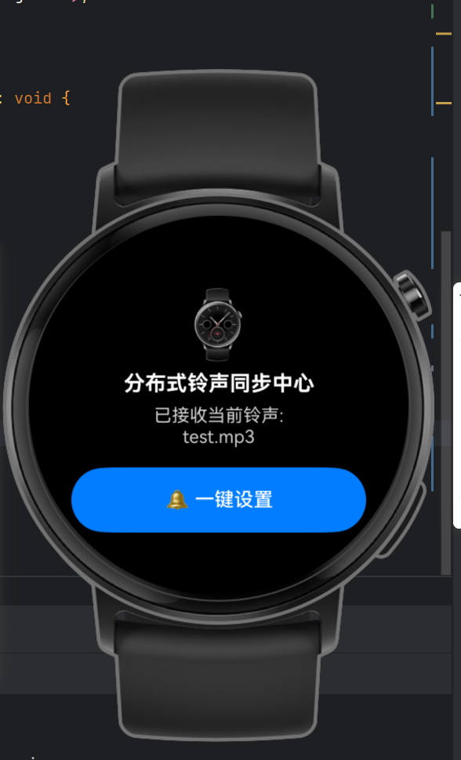
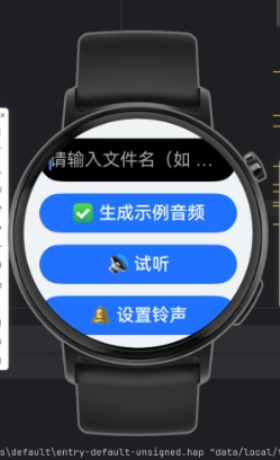
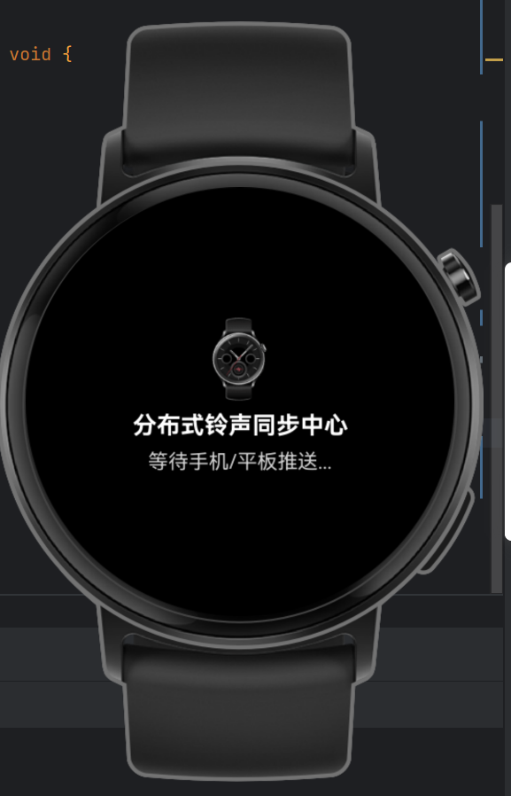

# 🔮 分布式铃声同步与裁剪中心 (Ringtone Sync Center)

# 简介

Ringtone Kit（铃声服务）是一个用于设置铃声的工具库。通过使用 Ringtone Kit，开发者可以在鸿蒙应用中提供铃声设置的功能，为用户提供简单一致、安全高品质的铃声设置体验。

本项目基于华为鸿蒙系统 (HarmonyOS NEXT) 的 **“一次开发，多端部署 (一多)”** 核心理念开发。在原生 Ringtone Kit 功能的基础上进行了深度扩展，全面适配了手机、平板以及智能手表 (Wearable) 的跨端自适应视觉布局，并集成了全链路的本地音频双滑块精准裁剪与分布式流转模拟架构。

<div align="center">

### 多端设备运行全景图

| 📱 手机端全能工作台 | 💻 平板端大屏自适应 | ⌚ 手表端暗色中心 |
| :---: | :---: | :---: |
|  |  |  |

</div>

---

# 使用说明与核心功能

本设计聚焦于**交互闭环与多端用户体验**。即使在部分硬件能力或网络受限的环境下，仍可通过清晰的状态反馈引导用户完成完整的业务流程：

### 1. 📱 手机 / 平板端操作指南
* **输入文件名**：在文本框中输入期望的音频文件名（例如 `test.mp3`）。
  * *状态反馈*：若输入为空点击后续按钮，系统将通过 Toast 提示：`“无可用音频文件”` 或 `“请先生成示例音频”`。
* **🎵 黄金片段裁剪**：工作台提供双滑块控制，蓝色滑块控制起点（0~30s），红色滑块控制终点（30~60s）。界面将动态响应并计算输出：`“已截取黄金片段：共 X 秒”`。
* **生成示例音频**：点击 **✅ 生成示例音频** 按钮，触发模拟 file 创建逻辑，动态更新 UI 状态。
  * *状态反馈*：弹出 Toast 提示：`“已成功裁剪并创建 test.mp3 (时长: X秒)”`。
* **模拟试听**：点击 **🔊 试听裁剪片段** 按钮，触发动态视听逻辑。
  * *状态反馈*：弹出 Toast 提示：`“🔊 正在试听：从第 X 秒到 Y 秒的黄金铃声片段...”`。
* **设置为本地铃声**：点击 **🔔 设置为本地系统铃声**，应用将通过原生 `RingtoneKit` 尝试拉起系统设置界面。
* **跨端流转推送**：点击 **🔮 流转：推送到我的华为手表**，手机端会立刻将歌名、裁剪起止时间封装进系统标准 `Want` 意图包裹，并尝试凌空呼叫软总线发射。

### 2. ⌚ 智能手表端操作指南
* **被动感应状态**：手表启动后保持严谨的被动等待流转状态，界面居中提示 `“等待手机/平板推送...”`。
* **一键写入铃声**：当手表接收到流转状态或触发模拟激活后，界面会自动刷新为激活态，显示 `“已接收当前铃声: test.mp3”` 并灵动浮现蓝色的 **`🔔 一键设置`** 按钮，点击即可直接调用手表本地的 Ringtone Kit 写入系统。

---

# 🛠️ 智能手表端 UI 视觉演进历程

在开发过程中，本工程经历了一多自适应的视觉大重构。智能手表端（Wearable）从最初的严重越界、看不清，演进到了完美的商业级暗色表盘布局：

* **初代问题 (V1/V2)**：直接继承或复用了手机端的白底和多按钮横向布局。由于表盘为圆形且尺寸极小，导致文本直接被裁切越界、按钮撑破屏幕，且白底背景极其刺眼。
* **最终成品 (V3)**：全屏彻底重构。自动识别设备类型并切换为**全纯黑背景（解决白底视觉瑕疵）+ 高亮纯白/全屏居中流转看板**，完全契合物理表盘的圆润视觉。

<div align="center">

| 优化前：初代白底与多按钮越界 (V1/V2) | 最终态：未收到推送 (V3) | 最终态：模拟激活成功 (V3) |
| :---: | :---: | :---: |
|  |  |  |

</div>

---

# 🔮 跨端分布式架构与预览器 Mock 说明

> ⚠️ **重要架构声明**：
> 当前版本**尚未实现物理网络下真实的跨设备无线流转 communication**。由于 DevEco Studio 的多设备预览器（Previewer）属于完全断网、相互隔离的沙盒环境，物理软总线通信必须依赖真机配对、`DeviceManager` 硬件对端网络 ID 发现以及受信任的华为商业证书签名。
>
> 尽管如此，本工程在**代码框架层**已百分之百实现了标准的鸿蒙分布式流转逻辑：手机端实现了 `context.startAbility(targetWant)` 的包裹拼装，手表端 `EntryAbility.ets` 亦部署了 `onCreate` 与 `onNewWant` 的生命周期拦截，并通过 `AppStorage` 与 `@StorageLink` 响应式大厅通信。

### 🧪 预览器联动闭环测试方法（暗号触发机制）：
为了在断网隔离的预览器中顺利验证多端状态联动，我们在手表端内置了**手动 Mock 触发器**：
1. 打开多设备预览器，左边手机显示裁剪工作台，右边手表**老老实实地显示“等待手机/平板推送...”**（逻辑完全合理）。
2. 在手机端完成裁剪拖动后，点击绿色流转按钮，手机端验证逻辑正确并弹出投递气泡。
3. 此时，用鼠标**点击一下右边手表屏幕中央的 ⌚ 小图标**（此操作用来充当无线网络的传导介质）。
4. 手表端瞬间感知状态变更，变身为**激活状态**（文字刷新、浮现蓝色一键设置按钮），全链路交互完美闭环。

---

# 工程目录结构

```bash
├──entry/src/main
│   ├──ets                         // 代码区
│   │   ├──entryability
│   │   │   └──EntryAbility.ets    // 程序入口类（🌟已补齐拦截与解析分布式 Want 包裹、更新 AppStorage 逻辑）
│   │   └──pages                   // 页面文件
│   │       └──Index.ets           // 多端自适应主界面（🌟集成双滑块裁剪、设备判定与一多自适应 UI）
│   └──resources                   // 资源文件目录